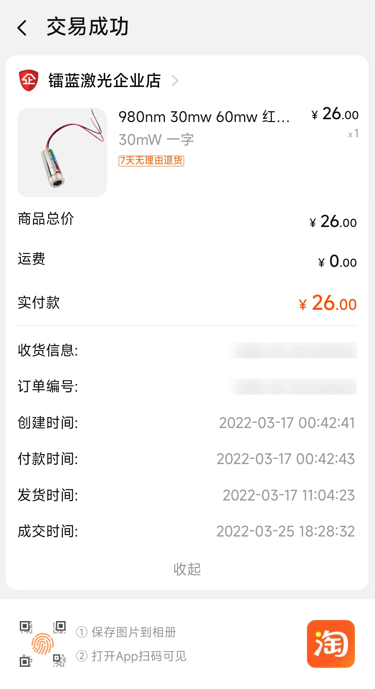
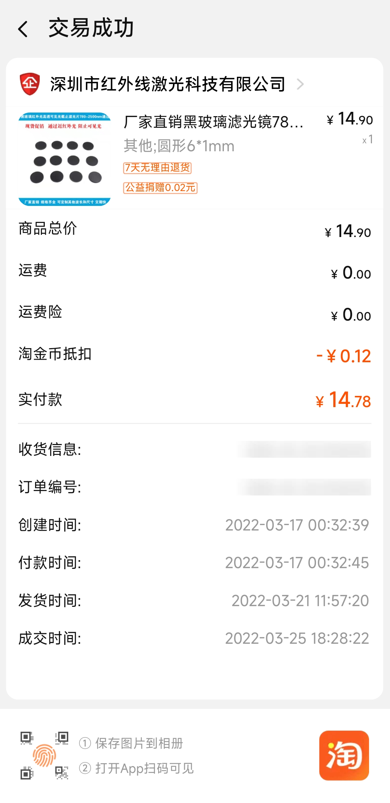
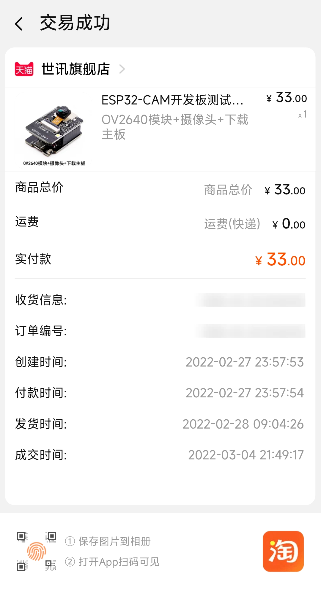
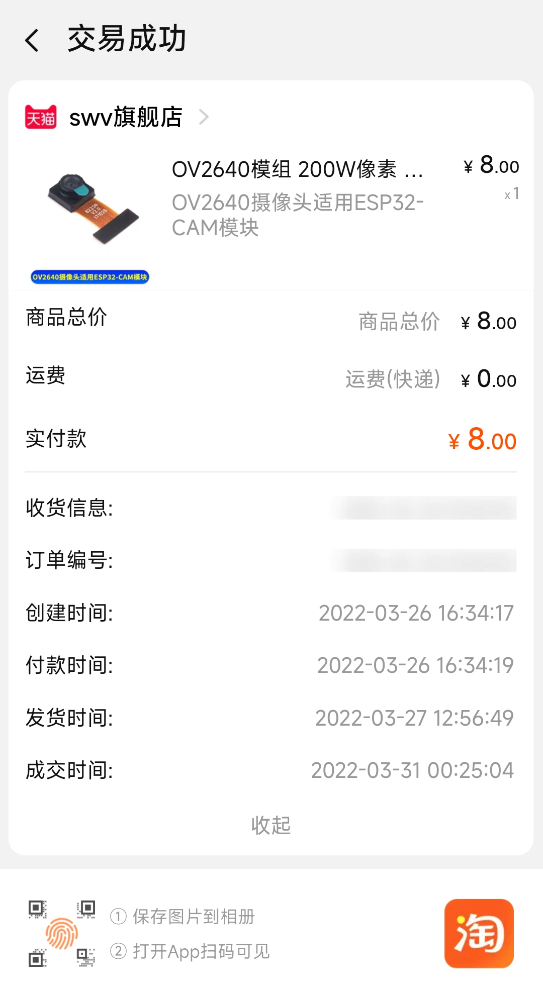
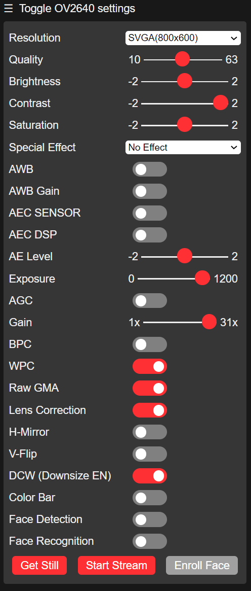
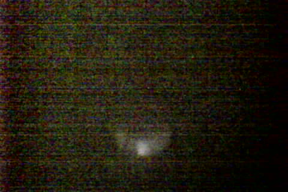
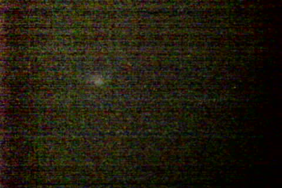

# ESP32-CAM 使用注意事项
1.请保证模块输入电源至少5V 2A,否则图片会有几率出现水纹。

2.ESP32 GPIO32管脚控制摄像头电源，当摄像头工作时，请把GPIO32拉低。

3.由于IO0连接摄像头XCLK,使用时请把IO0悬空，请勿接高低电平。

4.出厂已含有默认固件，不另外提供下载，如需重烧其他固件请谨慎操作。

# 硬件清单
</img></img>

</img></img>

# 如何用ov2640看到980nm红外光
1. 首先买一个高通滤波片装到相机上，滤掉可见光。

2. 如果漫反射的红外光太弱，则可以通过**提高曝光时间、提高增益**的方式看到红外光。如图：
   - 
   - 这是调试了好几天之后留下的血泪教训

# 参考资料

- [基于激光投影技术的虚拟键盘（硬件篇） - 知乎 (zhihu.com)](https://zhuanlan.zhihu.com/p/42963682)
- [Shape Matching using Hu Moments (C++ / Python) | LearnOpenCV](https://learnopencv.com/shape-matching-using-hu-moments-c-python/)
- [openCV Contours详解_huangjun2009的博客-CSDN博客_contours](https://blog.csdn.net/huangjun2009/article/details/89393527)
- [OpenCV——Canny边缘检测（cv2.Canny()）_m0_51402531的博客-CSDN博客_cv2.canny](https://blog.csdn.net/m0_51402531/article/details/121066693)

# 实验
- 开始实验的时候看不到红外光，我以为自己想的方案是不是不行，所以到处查资料看datasheet，看了下面这篇文章，以为esp32-cam上有ir filter，然后看到镜头上有个部分似乎可以拆卸，就想移除esp32-cam的ir filter，用刀切了半天都搞不定。
  - https://marksbench.com/electronics/removing-ir-filter-from-esp32-cam/
  - 最后才发现我买的没有ir filter，我切的部分根本就不是ir filter，只是镜头的一部分，麻了，这个摄像机废了，还好不贵，重新花10RMB买了同款（稍微不一样）。
- 基于http的图传性能很弱，很卡而且发热严重，到后面直接卡死。

**相机拍红外光效果：**

最好（数字2，最近且最中间）：

最差（数字9，较远且偏）：

